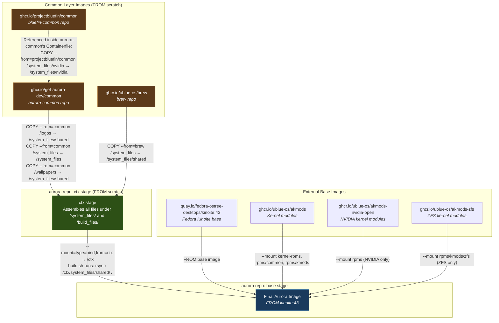
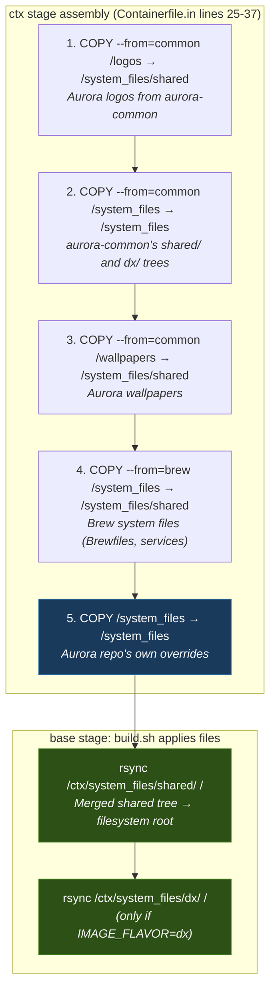
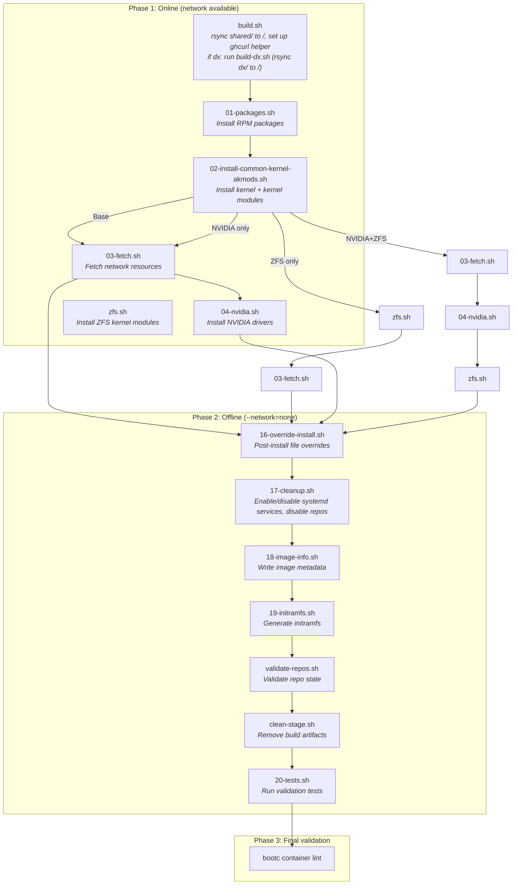

# Aurora Image Build System Architecture

This document explains how the Aurora desktop image is built from multiple "common" repositories, how files flow between them, and how build variants work.

## Repository Roles

| Repo | Published Image | Role |
|------|----------------|------|
| **bluefin-common** | `ghcr.io/projectbluefin/common` | Shared config for Bluefin (GNOME) and Aurora (KDE). Provides `system_files/shared/` (cross-desktop), `system_files/bluefin/` (GNOME-only), and `system_files/nvidia/` |
| **aurora-common** | `ghcr.io/get-aurora-dev/common` | Aurora/KDE-specific config. Provides `system_files/shared/`, `system_files/dx/`, wallpapers, logos, just recipes, flatpak lists, and brew definitions |
| **aurora** | `ghcr.io/ublue-os/aurora` (+ variants) | Final image build. Uses `Containerfile.in` with C preprocessor conditionals for NVIDIA/ZFS variants |
| **brew** | `ghcr.io/ublue-os/brew` | Homebrew integration layer. Contributes system files (Brewfiles, brew-setup service) |

## 1. OCI Image Composition Chain

This diagram shows how each published OCI image feeds into the next, ending at the final Aurora image. The `ctx` stage assembles all file sources before they are copied into the running image.



### Key details

- **bluefin-common** and **aurora-common** both publish `FROM scratch` images containing only configuration files -- no OS, no runtime. They are pure data layers.
- **aurora-common** itself pulls from **bluefin-common** during its own build: `COPY --from=ghcr.io/projectbluefin/common:latest /system_files/nvidia /system_files/nvidia`
- The aurora repo's **ctx stage** assembles all sources, then the **base stage** bind-mounts ctx at `/ctx` and uses `rsync` to copy files into the live Fedora Kinoite filesystem.
- **akmods** images are never copied into ctx -- they are bind-mounted directly into the base stage's RUN commands as `/tmp/kernel-rpms`, `/tmp/rpms/common`, `/tmp/rpms/kmods`, etc.

## 2. system_files Directory Merge Order

Files are layered in a specific order. **Later copies overwrite earlier ones**, so aurora's own `system_files/` has the final say.



### What each layer contributes

| Order | Source | Destination in ctx | Contents |
|-------|--------|-------------------|----------|
| 1 | aurora-common `/logos` | `/system_files/shared` | Aurora SVG logos (distributor-logo, banner, pride variants) |
| 2 | aurora-common `/system_files` | `/system_files` | `shared/` (KDE configs, scripts, systemd units, skel, SDDM theme, polkit, etc.) and `dx/` (VS Code, Docker, Incus configs) |
| 3 | aurora-common `/wallpapers` | `/system_files/shared` | Processed KDE wallpapers under `usr/share/backgrounds/aurora/` and `usr/share/wallpapers/` |
| 4 | brew `/system_files` | `/system_files/shared` | Homebrew Brewfiles, brew-setup systemd service |
| 5 | aurora repo `/system_files` | `/system_files` | Aurora-specific overrides: `rpm-ostreed.conf`, `flatpak-nuke-fedora.service`, SDDM themes mount, COPR vendor config, bazaar preinstall |

### Note on the "shared" name collision

- **bluefin-common** has `system_files/shared/` = files shared across **both** Bluefin (GNOME) and Aurora (KDE) desktops (udev rules, ujust completions, shell configs, container signing keys)
- **aurora-common** has `system_files/shared/` = files specific to **Aurora/KDE** (SDDM theme, KDE Plasma look-and-feel, Ptyxis terminal config, KDE default settings)
- These are different scopes but get merged into the same `/system_files/shared/` directory in the ctx stage. Since aurora-common's files are copied first (step 2) and brew's files overlay next (step 4), then aurora's own files last (step 5), the merge is additive with later files winning on conflict.

## 3. Build Script Execution Order

The `Containerfile.in` uses the C preprocessor to select which variant to build. The Justfile passes flags like `--cpp-flag=-DNVIDIA` and `--cpp-flag=-DZFS` based on the image name and tag.

### How variants are selected (Justfile logic)

```
image name contains "nvidia"  →  -DNVIDIA flag
akmods_flavor = "coreos-stable" (i.e., tag=stable)  →  -DZFS flag
```

### Execution order per variant



### Variant-specific script sequences (exact order)

| Variant | Flags | Online Phase Script Order |
|---------|-------|--------------------------|
| **Base** | _(none)_ | `build.sh` → `01-packages.sh` → `02-install-common-kernel-akmods.sh` → `03-fetch.sh` |
| **ZFS** | `-DZFS` | `build.sh` → `01-packages.sh` → `02-install-common-kernel-akmods.sh` → `zfs.sh` → `03-fetch.sh` |
| **NVIDIA** | `-DNVIDIA` | `build.sh` → `01-packages.sh` → `02-install-common-kernel-akmods.sh` → `03-fetch.sh` → `04-nvidia.sh` |
| **NVIDIA+ZFS** | `-DNVIDIA -DZFS` | `build.sh` → `01-packages.sh` → `02-install-common-kernel-akmods.sh` → `03-fetch.sh` → `04-nvidia.sh` → `zfs.sh` |

All variants then run the same **offline phase**: `16-override-install.sh` → `17-cleanup.sh` → `18-image-info.sh` → `19-initramfs.sh` → `validate-repos.sh` → `clean-stage.sh` → `20-tests.sh`

And the final **lint phase**: `bootc container lint`

### What build.sh does at the start of every build

1. Sets `keepcache=1` for faster rebuilds
2. Swaps `fedora-logos` for `generic-logos` (then erases generic-logos from RPM DB to unblock downstream `-logos` packages)
3. Runs `rsync -rvKl /ctx/system_files/shared/ /` -- this copies the merged shared tree into the filesystem root
4. If `IMAGE_FLAVOR == "dx"`, calls `build-dx.sh` which runs `rsync -rvK /ctx/system_files/dx/ /` and configures Docker/iptables support
5. Installs the `ghcurl` helper script to `PATH`

### What 17-cleanup.sh does in the offline phase

- Enables systemd services: `rpm-ostree-countme`, `tailscaled`, `dconf-update`, `brew-setup`, `aurora-groups`, `usr-share-sddm-themes.mount`, `ublue-system-setup`, `input-remapper`, `flatpak-nuke-fedora`, `flatpak-preinstall`
- Enables user services: `ublue-user-setup`, `podman-auto-update.timer`
- Enables `uupd.timer` (update timer), disables old `rpm-ostreed-automatic.timer`
- Hides desktop entries for `htop` and `nvtop`
- Disables all third-party repos that were added during the build (fedora-multimedia, tailscale, Terra, COPR repos, RPM Fusion, etc.)
